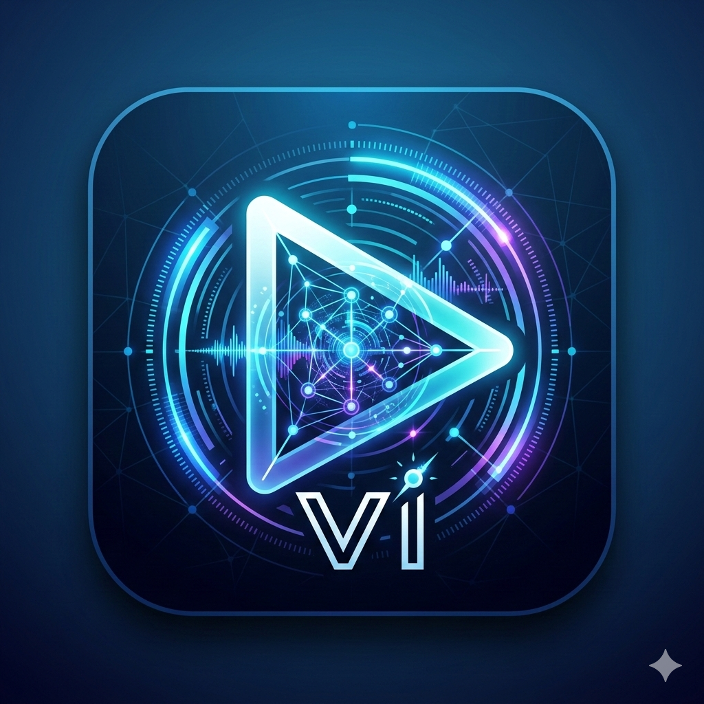

# Video Intelligence

**AI-powered video analysis with real-time sync.** Upload any video and get a structured, timestamped description of everything that happens — then search across your entire video library with a conversational AI agent.

Built for the [PowerSync AI Hackathon](https://www.powersync.com/blog/powersync-ai-hackathon-8k-in-prizes).



## The Problem

Video is the largest and fastest-growing data type on the internet, yet it remains the hardest to search, index, or use as context for AI. You can't Ctrl+F a video. Existing solutions either require expensive GPU infrastructure, process only thumbnails, or return shallow metadata. There's no affordable way to turn a video into structured data that LLMs and AI agents can actually use.

## What Video Intelligence Does

1. **Upload a video** (file or URL) through the web app or API
2. **Smart pipeline** reduces thousands of frames down to only the ones that matter (~97% dedup rate)
3. **AI describes every keyframe** with objects, actions, scene context, and camera movement
4. **Structured JSON timeline** returned — ready for LLMs, agents, search, or any downstream use
5. **Cross-video AI agent** lets you ask questions across your entire analyzed video library
6. **Real-time sync** via PowerSync — progress updates, results, and chat flow instantly to every connected client

### Example Output

A 52-second medical training video:
- **261 raw frames** reduced to **25 keyframes** (90% cost reduction)
- Full pipeline completes in **~43 seconds**
- Cost: **~$0.02** (Gemini Flash)

```json
{
  "summary": "A medical professional performs a blood draw on a female patient...",
  "timeline": [
    {
      "timestamp_start": "0:00.00",
      "timestamp_end": "0:02.40",
      "description": "A male medical professional in a white uniform and blue gloves is preparing to draw blood...",
      "detected_objects": ["person", "chair"],
      "camera_movement": "static",
      "confidence": 0.91
    }
  ]
}
```

## How PowerSync Is Used

PowerSync is the backbone of the real-time experience. Every piece of state that moves between server and client flows through PowerSync Sync Streams:

| What syncs | Direction | Why it matters |
|---|---|---|
| **Job status & progress** | Server → Client | Upload a video and watch the progress bar move in real-time — no polling |
| **Timeline entries** | Server → Client | Each keyframe description appears in the UI the moment the worker writes it to Postgres |
| **Chat messages** | Server → Client | Cross-video agent responses sync instantly across all tabs/devices |
| **Library messages** | Server → Client | Mastra agent conversation history is always up-to-date |

### Architecture

```
[React Frontend]
      |
      |--- PowerSync (WebSocket) ← real-time sync of jobs, timeline, chat
      |--- REST API (FastAPI) ← video upload, analysis trigger, auth
      |
[PowerSync Service] ←→ [Supabase Postgres]
                              ↑
                    [Celery Worker] — writes progress + results
                    [Mastra Agent] — writes chat responses
```

**Local-first with graceful fallback:** The frontend reads from a local SQLite replica (via PowerSync WASM). If PowerSync is unavailable, hooks automatically fall back to REST polling — the app never breaks.

### Sync Streams (4 streams, user-scoped)

```yaml
streams:
  user_jobs:           # Job status, progress, summary
  user_chat_messages:  # Per-video AI chat history
  user_timeline_entries: # Keyframe descriptions + metadata
  user_library_messages: # Cross-video agent conversations
```

All streams are scoped by `auth.user_id()` from the PowerSync JWT — each user only sees their own data.

## The Pipeline

```
Video Input → FFmpeg (resize + FPS reduction)
           → PySceneDetect (scene boundaries, streaming)
           → OpenCV pHash (perceptual dedup per scene)
           → Temporal density fallback (covers slow camera movement)
           → YOLOv8n (object detection + confidence scoring)
           → Audio analysis (Gemini Flash)
           → Vision model (Gemini Flash, per keyframe)
           → Stitcher (merge + overall summary)
           → Structured JSON output
```

**Key design decisions:**
- **Streaming scene detection** — PySceneDetect outputs boundaries as found; dedup starts per-scene immediately without waiting for the full pass
- **YOLO enriches, not filters** — Object detections are injected into the vision model prompt as context, improving description accuracy
- **Minimum-per-scene guarantee** — Never drops the last keyframe of a scene, preventing blind spots
- **Memory-only processing** — Only FFmpeg output and final JSON touch disk; everything else runs in-memory

## Tech Stack

| Layer | Technology |
|---|---|
| Frontend | React 18, TypeScript, Tailwind CSS, Three.js |
| Real-time sync | **PowerSync** (Sync Streams, WASM SQLite) |
| Backend API | FastAPI (Python) |
| Database | **Supabase** (PostgreSQL) |
| Job queue | Redis + Celery |
| Video processing | FFmpeg, OpenCV, PySceneDetect |
| Object detection | YOLOv8n (Ultralytics) |
| Vision + Audio AI | Gemini 2.5 Flash |
| Cross-video agent | **Mastra** (with tool-use for timeline search) |
| Auth | JWT + Google OAuth + argon2id passwords |
| Containerization | Docker Compose (4 services) |

## Project Structure

```
video_intelligence/
  api/          # FastAPI server (auth, endpoints, PowerSync JWT vending)
  pipeline/     # Video processing stages (preprocessor, keyframe, YOLO, vision, stitcher)
  workers/      # Celery worker (async pipeline execution, DB sync)
  web/          # React frontend (PowerSync, Three.js landing, chat UI)
  mastra/       # Cross-video AI agent (Gemini + PostgreSQL tool-use)
  tests/        # 245+ unit and integration tests
  landing_v2/   # Marketing landing page
```

## Getting Started

### Prerequisites
- Docker and Docker Compose
- A Gemini API key ([get one free](https://aistudio.google.com/apikey))
- A Supabase project ([free tier](https://supabase.com))
- A PowerSync account ([free tier](https://powersync.com))

### Setup

```bash
git clone https://github.com/glaogideonelorm/video-intelligence-powersync.git
cd video-intelligence-powersync/video_intelligence

# Copy and fill in your credentials
cp .env.example .env
# Edit .env with your GEMINI_API_KEY, DATABASE_URL, POWERSYNC_URL, etc.

# Build and run (4 containers: API, worker, Redis, Mastra agent)
docker compose build
docker compose up -d

# Open the app
open http://localhost:8000
```

### PowerSync Setup

1. Create a PowerSync project and connect it to your Supabase database
2. Paste `powersync.yaml` into Sync Streams > Edit, then Deploy
3. Under Client Auth, add an HS256 key with your `POWERSYNC_JWT_SECRET` (base64url-encoded)
4. Set `POWERSYNC_URL` and `POWERSYNC_JWT_SECRET` in `.env`

## Features

- **Video analysis** — Upload video files or paste URLs; supports mp4, mov, avi, mkv, webm
- **Real-time progress** — Watch pipeline stages complete live via PowerSync sync
- **Per-video AI chat** — Ask questions about a specific video's content
- **Cross-video library agent** — Search across all analyzed videos with natural language (powered by Mastra)
- **Structured JSON API** — Full REST API with OpenAPI docs at `/docs`
- **Google OAuth + email auth** — Secure JWT-based authentication
- **PWA support** — Installable, works offline (reads from local SQLite via PowerSync)
- **Dark mode** — Automatic theme detection with manual toggle
- **245+ tests** — Comprehensive test suite covering all pipeline stages

## Prize Categories

- **Core prizes** — Originality, technical depth, real-world usefulness
- **Best Supabase Submission** — Supabase is the primary database, connected to PowerSync for real-time sync
- **Best Mastra Submission** — Mastra powers the cross-video library agent with tool-use (timeline search, video listing)

## API Quick Start

```bash
# Register and get an API key
curl -X POST http://localhost:8000/v1/auth/register \
  -H "Content-Type: application/json" \
  -d '{"name":"You","email":"you@example.com","password":"secure123"}'

# Analyze a video
curl -X POST http://localhost:8000/v1/analyze \
  -H "Authorization: Bearer vi_live_YOUR_KEY" \
  -F "file=@video.mp4"

# Poll status
curl http://localhost:8000/v1/status/vid_xxx \
  -H "Authorization: Bearer vi_live_YOUR_KEY"

# Get results
curl http://localhost:8000/v1/result/vid_xxx \
  -H "Authorization: Bearer vi_live_YOUR_KEY"
```

## Team

- **Gideon Glago** — Solo developer

## License

MIT
